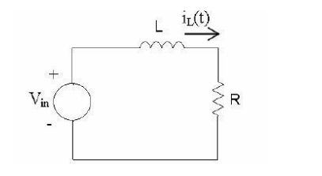

EU ODEIO ISSO EU QUERO MORRER

Uma bobina pode ser modelada por um circuito RL, e eu como não sei disso vou botar aqui pra eu não esquecer. Vai se fuder essa merda:

  

Essa imagem específica é da resolução da lista 3 de exercício, onde a bobina tá sendo alimentada por uma fonte doidinha cossenoidal. 