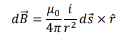
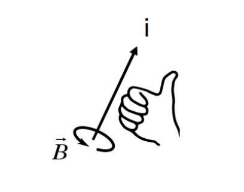
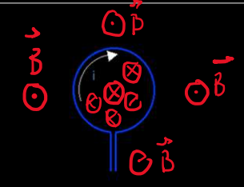
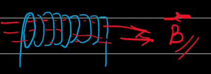
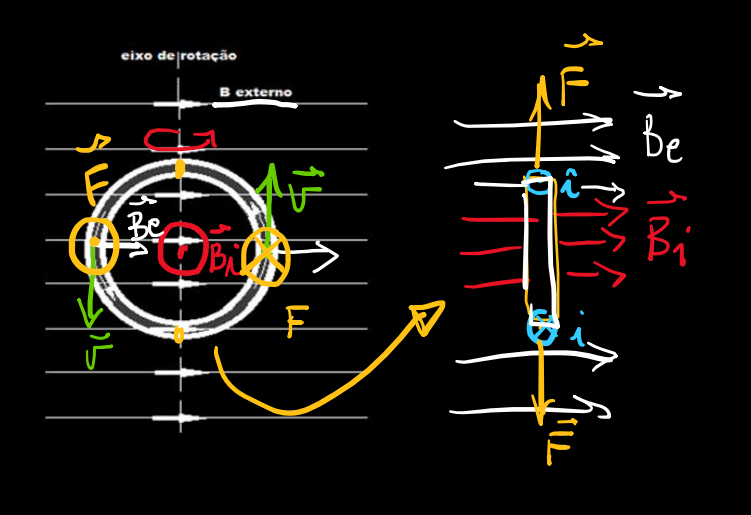
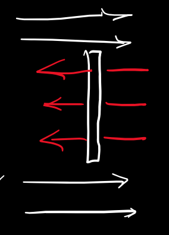

## Força Elétrica

$\vec{F}_{elet} = q\vec{E}$

## Força  Magnética

$\vec{F}_{mag} = q(\vec{v} \times \vec{B})$

## Força de Lorentz

A força de Lorentz é a soma da força elétrica e da magnética:

$\vec{F} = q(\vec{E} + \vec{v} \times \vec{B})$

## Lei de Biot-Savart

A lei de Biot-Savart é chata e difícil de usar. Ela é:  

Onde $\mu_{0}$ é a **permeabilidade magnética no vácuo**, de certa forma análoga à constante $\varepsilon_{0}$, a permissividade elétrica no vácuo. Mas ignora ela que a gente só usa ela qualitativamente mais pra frente pra poder dizer que algo faz isso pq biot-savart disso isso bla bla bla cê não precisa lembrar dela fica suave

## Regra da mão direita pra campo magnético

A regra da mão direita aí serve pra você determinar a direção e o sentido do campo magnético: 

Se você tem uma espira com uma corrente passando por ela, você gera campo magnético: 

E pra aumentar a intensidade do campo magnético, você pode adicionar umas espiras aí, fazendo uma bobina: 

A força magnética gera torque, o que pode fazer espiras girarem vroom, o que leva ao princípio do motor elétrico em corrente contínua. O sentido da rotação será sempre aquele que resultar no alinhamento dos campos 

O ponto de equilíbrio instável é o segundo ponto de equilíbrio, onde qualquer perturbação levaria ele a tentar voltar pro ponto de equilíbrio estável: 

