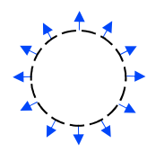
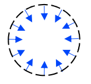
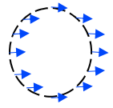

# Campos Vetoriais

## Equação Vetorial do campo gravitacional
$\vec{g} = \frac{1}{m} \vec{P}$

## Equação Vetorial do campo elétrico
$\vec{E} = \frac{\vec{F}}{q}$

## Trabalho de uma força
$W_{\vec{F}}=\int_{\gamma} \vec{F}\cdot d\vec{r}$

## Trabalho da força peso
O trabalho do peso não depende da trajetória, já que a força gravitacional é uma força conservativa. Ela se dá com a seguinte fórmula: 

$W_{p} = -(mg z_{b} - mg z_{a})$

## Campo vetorial conservativo
Um campo vetorial é conservativo quando:

$\vec{v}= \vec{\nabla} f$

$\oint \vec{v}\cdot d\vec{r} = 0$

Pra calcular o $\vec{\nabla}$, você precisa fazer a derivada parcial da função potencial $\phi$, que seria fazer a parcial da força em x, y e z.

**O campo vetorial $\vec{P}$ é o oposto do gradiente da energia potencial gravitacional. A energia potencial gravitacional $E_{pg}$ é o oposto da função potencial $\phi_{p}$:**

$E_{pg} = - \phi_{p}$

$\vec{P} = -\vec{\nabla} E_{pg}$

A integral de linha do campo gravitacional ao longo de uma trajetória $\gamma$ resulta no trabalho da força peso por unidade de massa:

$\int_{\gamma} \vec{g} \cdot d\vec{r} = \frac{W_{p}}{m}$

## Trabalho da força elétrica

Uma DDP de 110V, ou seja, 110J/C, significa que para levar uma carga elétrica de 1C de um ponto A a um ponto B, são necessários 110J de energia

$\int_{A}^B \vec{E}\cdot d\vec{r} = U_{A} - U_{B} = - \Delta U$

## No campo conservativo:

**Força**: Causa de aceleração  
**Campo**: Força disponível para cada unidade de carga (no caso elétrico) 
**Energia potencial**: Número relacionado ao trabalho de uma força 
**Potencial**: Energia disponível para cada unidade de carga (caso elétrico)

## Fluxo de um campo vetorial

Quando o fluxo de um campo através de uma superfície fechada é nulo, ou o campo vetorial é nulo, ou tudo que entra (fluxo negativo) sai (fluxo positivo)

 
$\phi_{1} = F\cdot 4\pi r^2$ 
$\phi_{2} = -F\cdot 4\pi r^2$ 
$\phi_{3} = 0$

## Lei de Gauss
A lei de Gauss é a **1ª equações de Maxwell**

$\phi_E= \oint \vec{E} \cdot \hat{n} dA = \frac{Q_{int}}{\varepsilon_{0}} = \oint EdA$    
Onde $\varepsilon_{0}$ é a permissividade elétrica no vácuo

## Fluxo Magnético
A seguinte equação é conhecida como Lei de Gauss para Campos Magnéticos, aka **2ª equação de Maxwell**  
$\phi_{B} = \oint \vec{B} \cdot \hat{n} dA = 0 = BA$