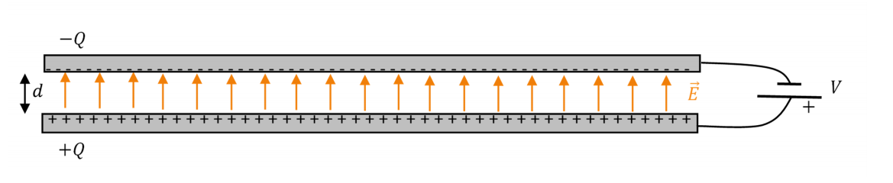

Os capacitores são um negócio que eu nunca me lembro direito como funciona, então eu vou deixar aqui mais organizado.

Basicamente, os capacitores são dispositivos que armazenam cargas elétricas, e, portanto, energia elétrica na forma de campo elétrico. Ele é formado por duas placas metálicas com um vácuo entre elas. Tipo isso aqui ó:

  

Na imagem acima, as duas placas foram conectadas aos polos de uma bateria de tensão contínua $V$. Long story short, elétrons são puxados de uma placa pra outra e as placas acabam ficando com cargas iguais $Q$ e $-Q$.

Como só tém vácuo entre as placas e o versor $\hat{j}$, a lei de Gauss nos diz que o campo elétrico resultante entre as placas é:

$\vec{E} = \frac{\sigma}{\varepsilon_{0}} \hat{j}    [V/m]$

(Nota: se as setinhas lá tiverem de cima pra baixo, isso ai em cima é negativo pq eh em função do versor j)

Onde $\sigma$ é a densidade superficial de carga nas placas, que têm a mesma área A, que dá:

$\sigma = \frac{Q}{A}$

Depois de um pouco de mágica, chegamos à conclusão de que a **capacitância** do capacitor é a razão entre a carga acumulada $Q$ e a diferença de potencial $V$:

$C = \frac{Q}{V} = \frac{A\varepsilon_{0}}{d}$

Onde A é a área das placas, d a distância entre elas, e $\varepsilon_{0}$ é a permissividade do meio entre elas. Se tiver um material entre elas é a mesma coisa só que enfia a permissividade elétrica do material. 

Por fim, pra calcular a energia elétrica armazenada num capacitor a gente lembra que energia é a integral no tempo da potência elétrica (lembrar de onde não sei nunca nem vi), e dá nisso aqui:

$E = \int_{0}^{t} V \cdot \frac{dQ}{dt} dt$

E como $V = \frac{Q}{C}$:

$E = \frac{CV^2}{2}$
