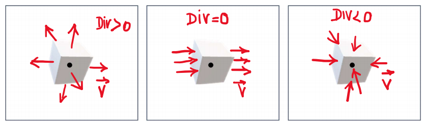

## Divergente de um campo vetorial
O divergente em um ponto é o limite da divisão entre o fluxo em uma superfície fechada pequena, que envolve esse ponto, e o volume dessa superfície:   
$Divergente = \lim_{V \to 0} \frac{\phi_{V}}{V}$ 
  

Pra calcular o divergente de um campo vetorial, você faz as derivadas parciais em x (em $\hat{i}$), em y (em $\hat{j}$), e em z (em $\hat{k}$).  
Exemplo:   
$\vec{E} = (3x-8y)\hat{i} + (y^2)\hat{j} + (-3xz + 5z^2)\hat{k}$  
$\frac{\partial Ex}{\partial x} = 3, \frac{\partial Ey}{\partial y} = 2y, \frac{\partial Ez}{\partial z} = -3x + 10z$  
$\vec{\nabla}\cdot\vec{E} = -3x + 2y + 10z + 3$

## Densidade volumétrica de carga

É a quantidade de carga por unidade de volume:  
$\frac{Q}{v} = $ Densidade volumétrica de carga = $\rho$

$\vec{\nabla}\cdot\vec{E} = \frac{\rho}{\varepsilon_{0}}$  
$\vec{\nabla}\cdot\vec{B} = 0$

**Não há carga elétrica no espaço em torno de uma carga Q**:

$\vec{\nabla}\cdot\vec{E} = 0$