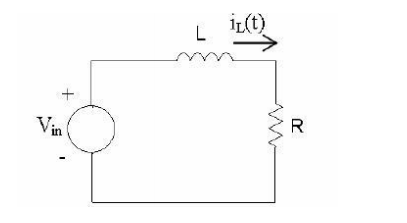

Eu tô fazendo essa parte na madrugada antes da PI, então se tiver errado pfv não me culpem essa matéria é o meu terror.

Nas palavras do nosso grande mestre Yama, a impedância é uma vadia que a gente faz pra transformar as coisas em Ohm, pra quando a vaca foi pro brejo e o circuito tem umas coisas que não fazem parte do URI mas a gente quer fazer o URI pra descobrir, normalmente, a corrente.

Vamos pegar de exemplo esse circuito relativamente fofo da lista 3:

  

Nesse caso a gente quer fazer URI pra descobrir a corrente de pico, mas como tem um indutor L, vamo calcular a impedância total do circuito pra poder fazer o URI. No negócio de indutância a gente disse que isso era a reatância, mas eu não sei a diferença:

$\dot{X_L}= jLw [\Omega]$  

E como a resistência R já tá em Ohms, pra calcular a impedância total do circuito a gente só soma:

$\dot{Z} = R + jLw$

No exercício ele mandou que a fonte que alimenta o circuito tem uma tensão cossenoidal de $U(t) = 12 cos(944t)$. Disso a gente descobre que $w=944$ e que a tensão eficaz é igual a 12. (As outras coisas ele deu no exercício preguiça de botar aqui)

$\dot{Z} = 3,77 + j\cdot 944\cdot 0,008$

$\dot{Z} = 3,77 + j7,55$

Aí com isso a gente pode fazer o URI:

$\dot{I} = \frac{\dot{U}}{\dot{Z}} = \frac{12}{3,77 + j7,55} = 0,635 - j1,272$

Que você enfia no notebook lá pra calcular módulo e pá
