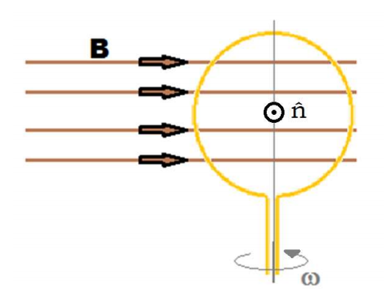
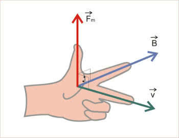
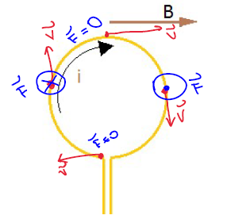
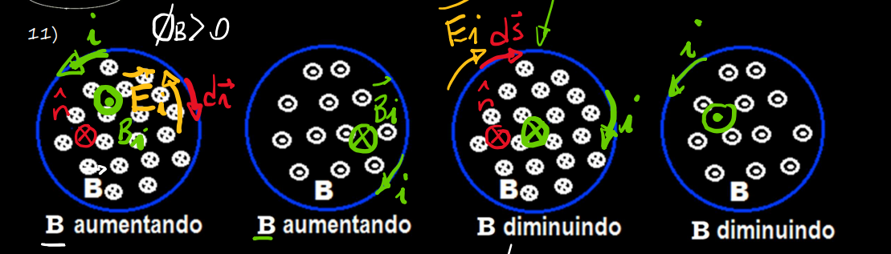
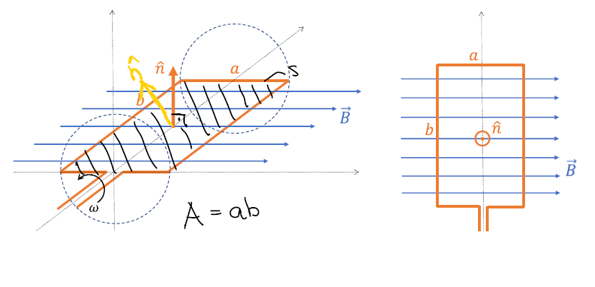

## Fluxo Magnético

Nas aulas passadas vimos a segunda lei de Maxwell:

$\phi_{B} = \oint \vec{B} \cdot \hat{n} dA = BA$

No caso de uma bobina chata de N espiras, temos:
$N\cdot \oint \vec{B} \cdot \hat{n} dA = NBA$

Com B uniforme na área 

Em uma bobina com N voltas e área A girando loucamente com velocidade constante w,  
  
temos:   
$\phi_{0} = \int \vec{B}\cdot\vec{n}dA$  
$\phi_{0} = \int\vec{B}\cos(\alpha) dA = BA\cdot\cos(\alpha)$  
$\phi_{0} = BAcos(\frac{\pi}{2} - wt)=BAsen(wt)$  
$\frac{d\phi_{0}}{dt} = BAwcos(wt)$

## Forças e Fluxos

Pra marcar as forças numa bobina girando, podemos usar a regra da mão esquerda: 

No caso o vetor velocidade é na mesma direção em sentido que a corrente. Nos pontos onde os vetores velocidade e campo magnético forem paralelos, não existe força. Por isso que ela gira, pq fica com uma força de um lado apontando pra cima, uma força em outro lado apontando pra baixo, e aí vrooom

## Indução Eletromangnética

A **3ª equação de Maxwell**, aka lei de Faraday, que calcula a **força eletromotriz**

$\oint \vec{E}\cdot d\vec{r} = - \frac{d\phi_{B}}{dt} = e$

Quando o fluxo **aumenta**, a força eletromotriz gerada tem o sentido de criar uma corrente que gera um campo de modo a **diminuir** o fluxo. Quando o fluxo **diminui**, surge uma força eletromotriz no sentido de gerar uuma corrente que gere um campo de modo a **aumentar** o fluxo.

O "sentido" da força eletromotriz nos condutores circulares (espiras fechadas):

(essa imagem é importante apreciem ela tá)

$\int_{A}^B \vec{E_{i}} d\vec{r} \simeq e$

## Conversão de Energia

Quando fazemos uma bobina girar em torno de um dos seus eixos de simetria, imerso em uma região onde há campo magnético, temos um **gerador elétrico**. Com a seguinte bobina de N voltas:  
  
Temos o seguinte fluxo magnético:  
$\phi_{B} = - NBAsen(wt)$

Conectando uma lâmpada de resistência R constante aos contatores da bobina, temos as seguintes corrente e tensão:

$e = - \frac{d\phi_{B}}{dt}$  
$-\frac{d\phi_{B}}{dt} = NBAwcos(wt) = e$  
$i = \frac{e}{R} = \frac{NBAwcos(wt)}{R}$

O torque da força eletromagnética gerada é:

$\vec{\tau_{F}} = \vec{r} \times \vec{F}$  
$\vec{\tau_{F}} = NBiAcos(wt)$  
$\vec{\tau_{F}} \cdot w = i\cdot e$

As forças eletromagnéticas que surgem são no sentido de **desacelerar** a bobina, e permanecem constantes:

$F = NBiL$