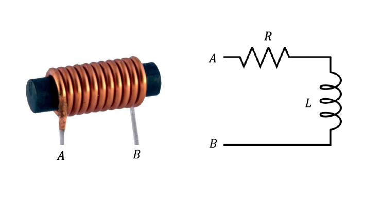

## Indutância

A indutância é dada por:

$L = \frac{\phi_B}{i} [H]$

De acordo com a lei de Biot-Savart, a corrente que é passada por uma espira é diretamente proporcional ao fluxo e o campo magnético, de modo que se ela dobrar, tanto o fluxo quanto o campo magnético irão dobrar também

Se a corrente for constante no tempo, o fluxo magnético também será constante, já que:

$\phi_{B} = L\cdot i$

E não haverá força eletromotriz:

$\frac{d\phi_{B}}{dt} = L\cdot \frac{di}{dt} = 0$  
$e = 0$

Se essa corrente variar, o fluxo varia e há força eletromotriz

Quando conectamos um fio condutor à uma fonte, é gerado um campo elétrico uniforme no seu interior. Porém, se essa fonte tiver tensão variável, surge uma corrente variável na espira, o que gera uma variação no fluxo magnético. Pela lei de Faraday (terceira lei de Maxwell), sabemos que uma variação no fluxo magnético causa um campo elétrico induzido. Nesse caso, o campo elétrico resultante seria a soma desses dois campos:

$\vec{E_{R}} = \vec{E_{f}} + \vec{E_{i}}$

$\vec{F} = q\cdot\vec{E_{R}}$

O campo elétrico resultante é, na verdade, o campo que efetivamente causa corrente elétrica. Se fizermos a integral de linha do campo elétrico resultante, e aplicando a lei de Ohm, temos:

$\int_{A}^{B} \vec{E_{R}} d\vec{r} = R\cdot i$  
$\int_{A}^{B} \vec{E_{R}} d\vec{r} = \int_{A}^{B} \vec{E_{f}} d\vec{r} + \int_{A}^{B} \vec{E_{i}} d\vec{r}$

Que pode ser calculado:

$\int_{A}^{B} \vec{E_{i}} d\vec{r} = -\frac{d\phi_{B}}{dt} = -L\frac{di}{dt}$  
$\int_{A}^{B} \vec{E_{f}} d\vec{r} = U_{f}$

Onde L é a indutância do indutor. Portanto temos:

$U_{f} = R\cdot i + L\frac{di}{dt}$

Quando a tensão e a corrente no indutor são representados por fasores complexos, a razão entre eles é o que chamamos de **reatância**. No indutor, essa reatância se dá:

$\dot{X_L}=\frac{\dot{V_{L}}}{\dot{I}}$  
$\dot{X_L}= jLw [\Omega]$  
$\dot{I} = \frac{\dot{U_F}}{\dot{X_L}}$

Se você adicionar uma resistência à um circuito com um indutor, você pode associar reatâncias e resistência em série e paralelo como se fossem resistores, mas com números complexos:

$\dot{I} = \frac{\dot{U_F}}{R + \dot{X_L}}$

Para fazer esses cálculos com números complexos fasoriais, pode usar o notebook Números Complexos em Python, que o prof soltou no black. Eu tinha um resuminho que como calcular fasores e pá mas sumiu e eu tô com preguiça de achar

Vale também lembrar que uma bobina pode ser modelada por um circuito RL, como o de cima, sendo R a resistência total do fio que a constitui e L a indutância da bobina. Assim, o modelo elétrico fica:

  

## Energia acumulada no indutor

Um negócio que eu só descobri também na parte nova da aula do Hage é que tem uma fórmula pra calcular a energia armazenada no indutor:

$E = \frac{Li^2}{2}$

