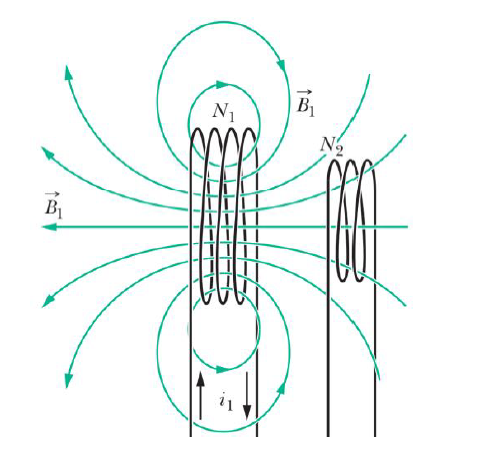
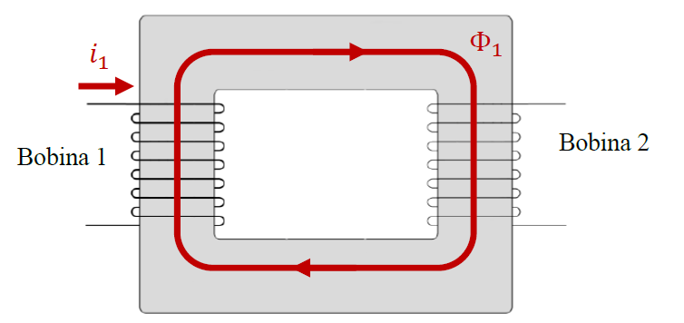

## Indutância Mútua

Em uma bobina de $N_1$ espiras que delimitam uma área A, percorrida por uma corrente $i_1$ que gera um campo magnético uniforme $\vec{B_1}$ no seu interior, temos o seguinte fluxo magnético:

$\phi_B = N_1 B_1 A$

Agora pensando em uma segunda bobina, de $N_2$ espiras e área A, posicionada de modo a atravessar parte das linhas do campo magnético gerado pela primeira, como na imagem abaixo: 

Temos o seguinte fluxo:

$\phi_2 = N_2 B_1 A$

Assim, chegamos as seguintes igualdades:

$\frac{\phi_1}{N_1} = \frac{\phi_2}{N_2}$  
$\frac{e_1}{e_2} = \frac{N_1}{N_2} = \frac{i_2}{i_1}$  
$e_1\cdot i_1 = e_2\cdot i_2$

Com isso, concluimos que se você eleva muito a tensão em um transformador, a corrente tem que cair na mesma proporção pra manter a relação da potência.

Isso só funciona se o campo magnético for uniforme nas duas e se elas tiverem a mesma área. 

Para que as linhas de campo das bobinas fiquem bonitinhas entre elas, colocamos um material ferromagnético juntando elas, o que denominamos de **transformador**:

A **indutância mútua** é a relação entre o fluxo magnético em uma bobina e a corrente que circula por outra, geradora do fluxo magnético. Na imagem acima, $\phi_1$ é o fluxo **por espira** na bobina 2, causado pela corrente que circula na bobina 1. Já que é o fluxo por espira, o fluxo total na bobina 2 é $N_2 \cdot \phi_1$, e a indutância mútua se dá por:

$M_{21} = \frac{N_2\cdot\phi_1}{i_1}$  
$M_{12} = \frac{N_1\cdot\phi_2}{i_2}$

Aplicando a lei de Ampere-Maxwell (quarta lei de Maxwell), temos que:

$B=\frac{\mu\cdot N\cdot i}{\ell}$

Portanto os fluxos por espira são:

$\phi_1 = \frac{\mu\cdot N_1 \cdot i_1}{\ell}\cdot A$  
$\phi_2 = \frac{\mu\cdot N_2 \cdot i_2}{\ell}\cdot A$

E as autoindutâncias dos enrolamentos primário e secundário são:

$L_1 = \frac{N_1\phi_1}{i_1} = \frac{\mu\cdot N_1^2\cdot A}{\ell}$   
$L_2 = \frac{N_2\phi_2}{i_2} = \frac{\mu\cdot N_2^2\cdot A}{\ell}$ 

E, portanto:

$M_{12} = M_{21} = M$  
$M = \frac{\mu\cdot N_1\cdot N_2\cdot A}{\ell}$  
$M = \sqrt{L_1 \cdot L_2}$

Aí com isso a gente chega naquelas igualdades com e lá em cima. 

Aí vem todo um negócio do transformador monofásico mas eu tô com preguiça de escrever então tá tudo lá na aula 6