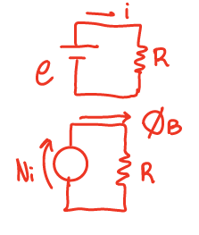
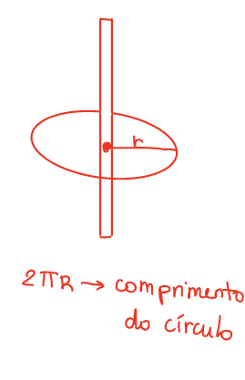
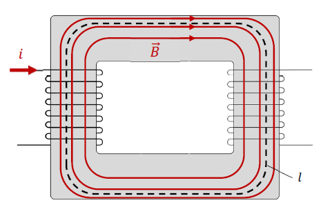
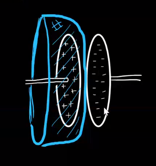

## Lei de Ampère

CARALHO NICOLE EU NÃO AGUENTO MAIS ESSA MATÉRIA

Anyways,

Hage resolveu ficar fancy, então a partir de agora chamaremos de **circuitação** a integral de linha em um caminho fechado. O exemplo que o Hage deu foi o trabalho de uma força ao longo de uma trajetória, dado por uma integral de linha:

$\tau = \int_\gamma \vec{F}\cdot d\vec{s}$

Se os pontos inicial e final da trajetória coincidirem, você considera ela uma integral fechada:

$\tau = \oint_\gamma \vec{F}\cdot d\vec{s}$

Nesse caso, dizemos que o trabalho é a circuitação da força $\vec{F}$ ao longo da trajetória $\gamma$. Outro exemplo é que a força eltromotriz é a circuitação do campo elétrico induzido ao longo de um circuito fechado.

Do mesmo modo que a circuitação do campo elétrico induzido ao longo de um circuito fechado é a força eletromotriz, podemos dizer que a circuitação do campo magnético ao longo de uma trajetória fechada é a **força magnemotriz**:

$e = \oint \vec{E_i}\cdot d\vec{s} = FEM$  
$\oint \vec{B}\cdot d\vec{s} = FMM$

A **Lei de Ampere** é definida desse modo:

$\oint \vec{B}\cdot d \vec{s} = \mu_0 \cdot i$

Observe a imagem abaixo, tirada do nosso queridinho, o Halliday:

Temos que:

$\oint_a \vec{B}\cdot d\vec{s} = \mu_0\cdot(2i-i) = \mu_0\cdot i$  
$\oint_a \vec{B}\cdot d\vec{s} = \mu_0\cdot(i-i) = 0$  
$\oint_a \vec{B}\cdot d\vec{s} = -\mu_0\cdot i$  
$\oint_a \vec{B}\cdot d\vec{s} = 2\mu_0\cdot$  
$ d>a=c>b$

(Esse foi o único momento da minha vida que eu pensei "olha que legal eu consegui fazer")(Mas não se preocupa que doppler é tão fácil que dá vontade de chorar e abraçar o Carareto)

A lei de Ampere é boa pra calcular o campo magnético quando tem simetria. Num fio retilínio, por exemplo:

$\oint\vec{B}\cdot d\vec{r} = \mu_0\cdot i$  
$B\cdot\oint dr = \mu_0\cdot i$  
$B\cdot 2\pi R = \mu_0\cdot i$  
$B = \frac{\mu_0\cdot i}{2\pi R}$

Também da pra usar a lei de Ampere num solenoide(aka transformador). Por exemplo:

$\oint\vec{B}\cdot d\vec{r} = \mu_0\cdot i$  
$B\cdot\ell = \mu\cdot N\cdot i$  
$B=\frac{\mu\cdot N\cdot i}{\ell}$

Que é a mesma fórmula que a gente achou na aula passada

Porém, se você for tentar fazer a circuitação do campo magnético em uma área que não passa corrente, como por exemplo esse negócio bizarro aqui, onde a área que estamos utilizando é uma semi esfera oca que passa no meio de um capacitor (veja que o fio com corrente i não atravessa a área da semi esfera que delimitamos):

Então, como não tem corrente atravessando a área, o campo magnético B seria zero, o que é um absurdo vendo que existe, sim, um campo magnético em volta de um fio com corrente. Isso é uma "falha" da lei de Ampere (não é uma falha mesmo pq a lei continua válida, mas nesse caso específico a vaca foi pro brejo). Vamo calcular o campo magnético de outro jeito então, com a lei de Gauss. Ela diz que:

$\phi_E = \frac{Q_int}{\varepsilon_0}$

Como a carga no capacitor é proveninente da corrente no fio, a derivada $\frac{dQ}{dt}$ é exatamente a corrente i. Aí temos:

$\frac{d\phi_E}{dt} = \frac{dQ}{dt}\cdot \frac{1}{\varepsilon_0}$  
$\frac{d\phi_E}{dt} = \frac{i}{\varepsilon_0}$  
$i = \varepsilon_0\cdot\frac{d\phi_E}{dt}$

Esse negócio é o seguinte: temos a corrente comum que todos conhecemos e amamos, passando pelo fio, elétrons fuindo ao longo de um condutor, super fofa. Mas na situação acima, não há fluxo de elétrons entre as placas, então não tem uma corrente comum. Esse bago feio aí a gente chama de **corrente de deslocamento**, e ela é feia e ninguém gosta dela, mas ela é válida e o modelo funciona com ela. Portanto, nosso amigo Maxwell corrigiu a lei de Ampere:

$\oint_\gamma \vec{B}\cdot d\vec{r} = \mu_0\cdot(i+\varepsilon_0\cdot\frac{d\phi_E}{dt})$